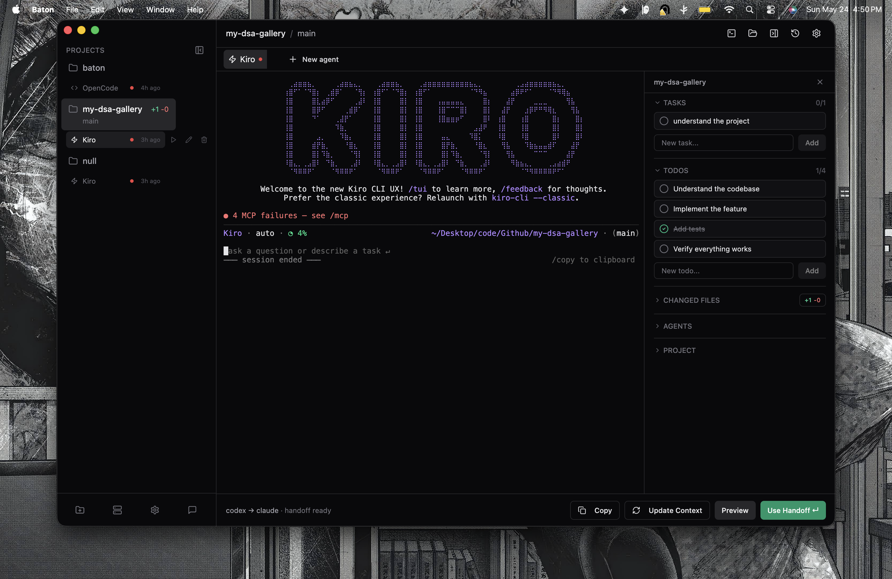

# Baton

> Pass context between AI coding agents — seamlessly switch between Codex, Claude Code, OpenCode, Gemini CLI, Kiro, and more.

<p align="center">
  <a href="https://batonai.pages.dev/">
    
  </a>
</p>

<p align="center">
  <a href="https://batonai.pages.dev/">batonai.pages.dev</a>
</p>

Baton is a desktop app that lets you hand off work between AI coding agents without losing context. It creates a structured **Baton Pass** — a markdown document capturing git diff, task state, decisions, and next steps — so the next agent picks up exactly where the last one left off.

## How it works

1. **Add a project** — Baton creates a `.baton/` bridge directory in it
2. **Run an agent** — launches in a PTY terminal with context from the project
3. **Create a Baton Pass** — captures git diff, task state, and decisions as a structured handoff document
4. **Switch agents** — the next agent reads the handoff and continues seamlessly

Sessions persist across app restarts via SQLite. Each session can be renamed or deleted from the sidebar.

## Roadmap

| Phase | What |
|-------|------|
| **v1** (current) | **File-based handoff** — agents exchange context via `.baton/latest-handoff.md` in the project directory |
| **v2** (next) | **Shared context memory layer** — persistent memory that agents can read/write to across sessions, beyond a single handoff file |
| **v3** (future) | **Multi-agent teams** — one "brain" agent orchestrates specialists (engineer, designer, tester). Users assemble their own team — for example, Codex as the brain, Claude as the designer, OpenCode as the engineer, Gemini as the tester. Build your own **Avengers**. |

## Local install

```bash
# 1. Clone the repo
git clone git@github.com:kzoldyk/baton.git
cd baton

# 2. Install dependencies
npm install

# 3. Run Baton in development
npm run dev
```

## Build locally

```bash
# Typecheck and build Electron output
npm run build

# Create a local app package in release/
npm run dist

# macOS-only package command
npm run dist:mac
```

The generated macOS app/DMG is for local use unless it is signed and notarized with an Apple Developer account.
Without Apple notarization, macOS may show Gatekeeper warnings. You can still run a local build manually from Finder or Terminal.

## Optional persistent sessions

Baton can run agents without `tmux`, but persistent background sessions work best when `tmux` is installed.

macOS:

```bash
brew install tmux
```

Ubuntu/Debian:

```bash
sudo apt update
sudo apt install tmux
```

Fedora:

```bash
sudo dnf install tmux
```

Verify:

```bash
tmux -V
```

## Agent CLI setup

Baton detects installed coding agents from your PATH. Install whichever agents you want to use, then restart Baton.

Common command names:

```bash
codex       # Codex
claude      # Claude Code
opencode    # OpenCode
gemini      # Gemini CLI
kiro-cli    # Kiro
```

On macOS, GUI apps can have a smaller PATH than your terminal. Baton checks common locations like `/opt/homebrew/bin`, `/usr/local/bin`, `~/.local/bin`, `~/.bun/bin`, `~/.deno/bin`, and `~/.cargo/bin`.

## Supported agents

- **Codex** — `codex`
- **Claude Code** — `claude`
- **OpenCode** — `opencode`
- **Gemini CLI** — `gemini`
- **Kiro CLI** — `kiro-cli`
